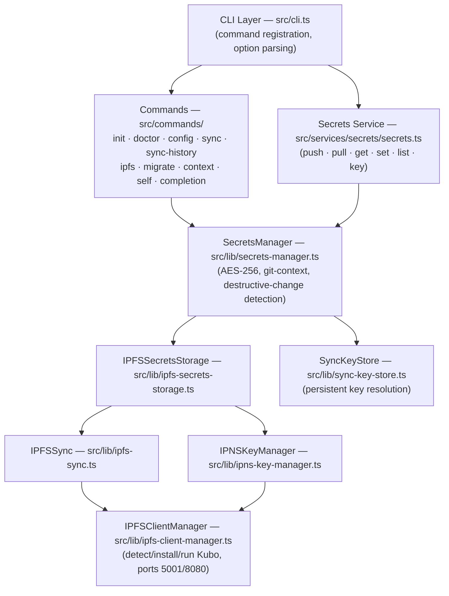
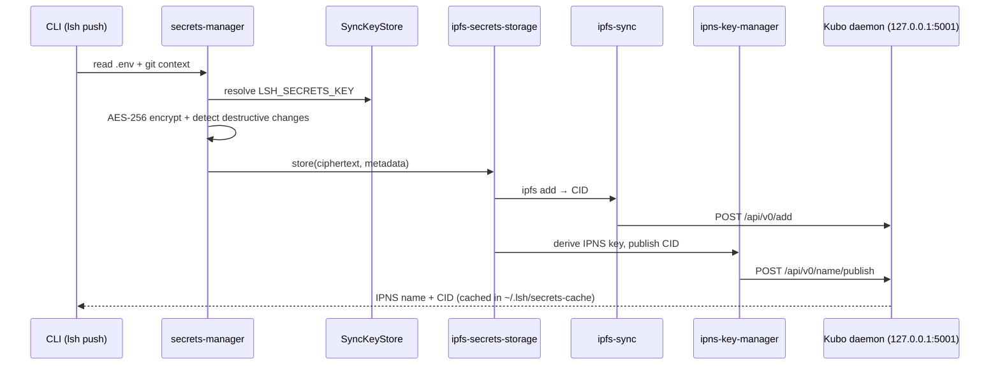
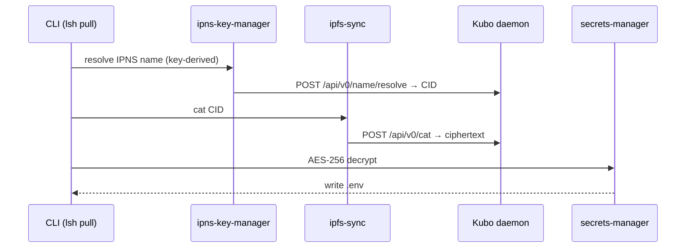

# LSH Architecture

This document describes the high-level architecture and module dependencies of LSH as it exists today.

> **Status note (v3.5.0).** LSH has pivoted from a broad shell/daemon/CI-CD platform into a
> focused **encrypted secrets manager** that syncs `.env` files over **IPFS** (Kubo) with
> IPNS-based deterministic naming. The shell parser/executor and ZSH-compatibility layers
> described in older revisions of this document were removed earlier; in **v3.5.0** the
> remaining dormant cluster (SaaS multi-tenant, job/cron daemon, Supabase/Postgres
> persistence) — which compiled but was never wired into the CLI — was **deleted**. What is
> documented below is now the whole of the codebase, not a subset.

## Overview

LSH is an encrypted secrets manager. The user encrypts a `.env` locally with a key, the
ciphertext is added to IPFS via a local Kubo daemon, and an IPNS name (derived from the key)
gives the blob a stable address so any machine sharing the key can resolve and pull it.



## Entry points

| File | Purpose |
|------|---------|
| `src/cli.ts` | Sole runtime entry. Registers the secrets-centric command set with Commander. |
| `dist/cli.js` | The published `lsh` bin (built from `src/cli.ts`). |

> LSH ships as a CLI, not a library; the CLI is the only supported surface. The
> `package.json` `main` field points at `dist/cli.js` (the built entry).

## Active module graph

### Commands (`src/commands/`)

| Command file | Registers | Depends on (lib) |
|---|---|---|
| `init.ts` | `lsh init` | `platform-utils`, `git-utils` |
| `doctor.ts` | `lsh doctor` | `platform-utils`, `ipfs-client-manager`, `ipfs-sync` |
| `config.ts` | `lsh config` | `config-manager`, `constants` |
| `sync.ts` | `lsh sync` | `ipfs-sync`, `ipfs-client-manager`, `ipns-key-manager`, `git-utils` |
| `sync-history.ts` | `lsh sync-history` | `ipfs-sync-logger`, `git-utils` |
| `ipfs.ts` | `lsh ipfs` | `ipfs-client-manager`, `ipfs-sync`, `ipns-key-manager`, `git-utils` |
| `migrate.ts` | `lsh migrate` | `git-utils` |
| `context.ts` | `lsh context` | — (emits llms.txt-style context) |
| `self.ts` | `lsh self` | `constants` |
| `completion.ts` | `lsh completion` | — |

`src/services/secrets/secrets.ts` registers the core verbs (`push`, `pull`, `get`, `set`,
`list`, `key`) and depends on `secrets-manager`, `git-utils`, `format-utils`,
`ipfs-client-manager`, `sync-key-store`, `constants`.

### Secrets + IPFS core (`src/lib/`)

```
secrets-manager.ts            AES-256 encrypt/decrypt, git repo/branch context,
  ├── logger.ts               destructive-change detection
  ├── git-utils.ts
  ├── ipfs-sync-logger.ts
  ├── ipfs-secrets-storage.ts ── orchestrates store/retrieve over IPFS
  │     ├── ipfs-sync.ts       ── `ipfs add` / cat via Kubo HTTP API (127.0.0.1:5001)
  │     ├── ipns-key-manager.ts── key-derived IPNS name publish/resolve
  │     └── (back-ref) secrets-manager.ts
  ├── sync-key-store.ts        persistent key resolution (env / .env / ~/.config/lsh)
  └── lsh-error.ts

ipfs-client-manager.ts         detect/install/start/stop Kubo, version pinning, health checks
config-manager.ts              lsh config read/write
platform-utils.ts              OS/arch detection for Kubo binaries
format-utils.ts                table/JSON/yaml output helpers
constants/                     centralized strings (see below)
```

> `secrets-manager.ts` and `ipfs-secrets-storage.ts` reference each other (the storage layer
> reuses the manager's crypto helpers). This is the one intentional cycle in the active core.

### Constants (`src/constants/`)

| File | Purpose |
|------|---------|
| `index.ts` | Re-exports all constants |
| `paths.ts` | File/cache/socket paths (`~/.lsh`, `~/.config/lsh`) |
| `config.ts` | Defaults, Kubo ports, IPNS settings |
| `commands.ts` | CLI command/verb names |
| `errors.ts` | Error messages |
| `api.ts` | HTTP endpoints/headers (Kubo API, pinning) |
| `database.ts` | Table names (used only by dormant cluster) |
| `ui.ts` | Help text, banners, colors |
| `validation.ts` | Validation patterns/limits |

The custom ESLint rule `lsh/no-hardcoded-strings` (currently `warn`) enforces use of these.

### Error handling (`src/lib/lsh-error.ts`)

```
LSHError (structured error class)
  ├── code: ErrorCode          (ErrorCodes.* constants)
  ├── message: string
  ├── context?: Record<string, unknown>
  └── statusCode: number
Utilities
  ├── extractErrorMessage(unknown): string   ← use instead of (e as Error).message
  ├── extractErrorDetails(unknown): object
  ├── wrapAsLSHError(e, code, ctx): LSHError
  └── isLSHError(unknown, code?): boolean
```

## Data flows

### `lsh push`



### `lsh pull`



Optional durability: a remote pinning service (e.g. Pinata) can pin the CID so the blob
survives when the local Kubo node is offline. `lsh doctor` verifies Kubo is installed and
running; `lsh init` performs first-time key + Kubo setup.

## Security considerations

1. **Secrets encryption** — AES-256 for all stored `.env` content; keys never leave the machine.
2. **Key handling** — `LSH_SECRETS_KEY` resolved via `SyncKeyStore` (env → `.env` → `~/.config/lsh`); shared out-of-band (password manager) for team sync.
3. **Destructive-change detection** — `secrets-manager` refuses to overwrite a remote blob that would drop keys without an explicit flag.
4. **Input validation** — `command-validator.ts` / `env-validator.ts` / `validation-framework.ts` remain in the tree with strong coverage; they gate the dormant daemon/API surface and are available for reuse.

## Testing strategy

- **Framework:** Jest + ts-jest, run via `node --experimental-vm-modules ./node_modules/.bin/jest`.
- **Location:** top-level `__tests__/` (unit + integration).
- **CI exclusions (`jest.config.*` `testPathIgnorePatterns`):** IPFS/secrets tests that need a live Kubo node or network, multi-host sync, and testcontainer-based security tests are skipped in CI and run manually.
- **Network discipline:** any module performing outbound `fetch` (e.g. `ipfs-client-manager.getLatestKuboVersion`) **must** bound the request with `AbortSignal.timeout` so a blocked/slow network falls back instead of hanging the CLI or a test.
- **Coverage scope (`collectCoverageFrom`):** excludes `cli.ts`, `commands/**`, `services/daemon/**`, and the SaaS API — these require integration testing. Be aware that headline coverage numbers therefore describe the pure-logic core, not the user-facing CLI.

## Removed in v3.5.0

The pre-pivot platform cluster — SaaS multi-tenant (`saas-*`, `saas-api-*`), the job/cron
daemon (`job-manager`, `cron-job-manager`, `daemon-client`, `daemon/lshd`, `services/{cron,daemon}`),
and Supabase/Postgres persistence (`supabase-client`, `database-persistence`,
`database-{schema,types}`, `cloud-config-manager`, `enhanced-history-system`) — was deleted in
v3.5.0. It compiled but had no inbound edges from the CLI, so it was removed as a unit along
with its tests.

A few generic utilities that are not currently wired into the CLI are intentionally **kept**
as reusable building blocks (e.g. `command-validator`, `env-validator`, `validation-*`,
`metrics/*`, `min-heap`, `fuzzy-match`, `string-utils`, `constant-time`). They are dependency-free
of the removed cluster and carry their own tests.

## Adding new features

1. [ ] Define types alongside the feature (the active core does not use the `saas-types` split).
2. [ ] Implement in `src/lib/` with `LSHError`-based error handling.
3. [ ] Add a command in `src/commands/` (or a verb in `src/services/secrets/secrets.ts`).
4. [ ] Register it in `src/cli.ts`.
5. [ ] Add user-facing strings to `src/constants/`.
6. [ ] Bound any outbound network call with a timeout.
7. [ ] Write tests in `__tests__/`; mock Kubo/network for unit tests.
8. [ ] Update this document if the architecture changes.
