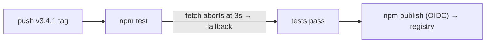

# 3.4.1 — Publish-pipeline fix, CI alignment, docs accuracy

Patch release. **3.4.0 was never published to npm** — its release-gate test hung on the
self-hosted runner and the publish step never ran. This release fixes the root cause so the
3.4.x line reaches npm, and corrects two long-standing accuracy issues.

## Fixes

### Unbounded network fetch hung the publish gate (P0)
`IPFSClientManager.getLatestKuboVersion()` performed `fetch('https://api.github.com/...')`
with **no timeout**. On a runner with blocked/slow outbound network the request never
returned, so `__tests__/ipfs-client-manager.test.ts › getLatestKuboVersion › should return a
version string` exceeded Jest's 5000 ms timeout and failed — which in turn failed the `npm test`
step in `publish.yml` *before* `npm publish` could run. Every 3.4.0 publish attempt died here.

Fix: bound the request with `AbortSignal.timeout(3000)` so a blocked network falls back to the
pinned stable version (`0.26.0`) well within the test timeout. This also hardens `install()`,
which calls the same method.

```diff
- const response = await fetch('https://api.github.com/repos/ipfs/kubo/releases/latest');
+ const response = await fetch('https://api.github.com/repos/ipfs/kubo/releases/latest', {
+   signal: AbortSignal.timeout(3000),
+ });
```

### CI Node version mismatch
`.github/workflows/node.js.yml` pinned Node `20.9.0` while `package.json` `engines` requires
`>=20.18.0` (and `publish.yml` already used `20.18.0`). Bumped the workflow's `NODE_VERSION`,
build/test matrix, and coverage condition to `20.18.0` so CI matches the supported runtime.

## Docs

`docs/ARCHITECTURE.md` was frozen at the pre-pivot platform design — it documented a
`shell-executor`/`shell-parser`, a ZSH-compatibility layer, an `src/cicd/` webhook stack, an
`src/app.tsx` entry, and a Supabase-backed secrets flow, **none of which exist anymore**.
Rewritten to describe the actual IPFS/Kubo secrets architecture, with accurate module graph,
push/pull sequence diagrams, and a clearly-labeled **Legacy / dormant modules** section
listing the SaaS/job/daemon/Supabase cluster that is not wired into the CLI and is slated for
removal in 3.5.0.

## Before / After

**Before** — publish gate hangs, version never ships


**After** — fetch bounded, gate passes, version ships


## Verification

- `npm run typecheck` — 0 errors
- `__tests__/ipfs-client-manager.test.ts` — 25/25 pass, 3.3 s (was: timeout at 5 s)
- Local `act` gate (`mcli ci preflight`) green
