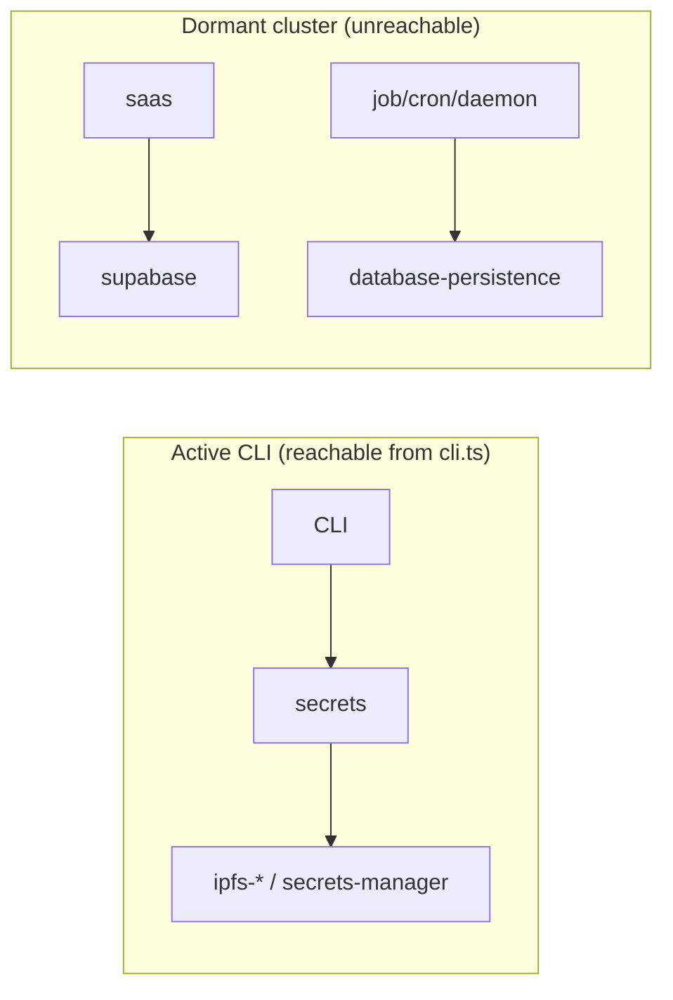
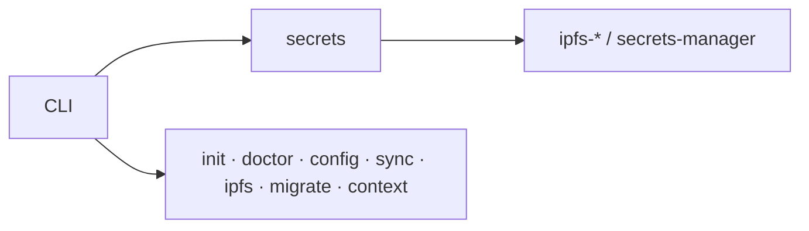

# 3.5.0 — Remove dormant platform cluster

Minor release. Completes the pivot to a focused encrypted-secrets CLI by **deleting** the
pre-pivot platform code that compiled but was never wired into the CLI. No user-facing CLI
behavior changes — the removed code was unreachable from `src/cli.ts`.

## Removed

The cluster was internally interconnected but had **zero inbound edges from the active CLI
surface** (verified by computing the import closure from `src/cli.ts`), so it was removed as a
unit along with its tests:

| Area | Modules |
|---|---|
| SaaS multi-tenant | `saas-{auth,organizations,secrets,billing,encryption,audit,email,types}`, `daemon/saas-api-{server,routes}` |
| Job / cron daemon | `job-manager`, `base-job-manager`, `cron-job-manager`, `job-storage-{database,memory}`, `optimized-job-scheduler`, `daemon-client`, `daemon-client-helper`, `base-command-registrar`, `daemon/{lshd,job-registry}`, `services/{cron,daemon}/**` |
| Supabase / Postgres | `supabase-client`, `supabase-utils`, `database-persistence`, `database-{schema,types}`, `cloud-config-manager`, `enhanced-history-system`, `history-system`, `local-storage-adapter`, `api-response`, `services/supabase/**` |

38 source files + 26 test files removed. Generic utilities not tied to the cluster
(`command-validator`, `env-validator`, `validation-*`, `metrics/*`, `min-heap`, `fuzzy-match`,
`string-utils`, `constant-time`) were **kept** as reusable building blocks.

## Fixes

- **Dangling `main` field**: `package.json` `main` pointed at `dist/app.js`, which has no
  source and is never built. Repointed to `dist/cli.js` (the actual entry; `lsh` is CLI-only).
- **Explicit ambient types**: added `"types": ["node"]` to `tsconfig.json`. The build had been
  implicitly relying on auto-inclusion of all visible `@types`, which is fragile — pruning the
  cluster perturbed it and dropped node globals (`process`, `NodeJS`, `Error.captureStackTrace`).
  Pinning node makes the type environment deterministic regardless of the source-file graph.

## Before / After (module graph)

**Before** — active CLI core plus a disconnected dormant island

**After** — only the active core remains

## Verification

- `npm run typecheck` / `npm run build` — 0 errors
- Full suite — **992 passed**, 28 skipped, 0 failed (test count drops with the removed cluster suites)
- Import closure from `src/cli.ts` confirms none of the removed modules were reachable

## Follow-up (not in this release)

`README.md`, `llms.txt`, and the repo `CLAUDE.md` still describe the old daemon/cron/API/SaaS
features in places (pre-existing doc debt — those commands were already not registered in the
CLI before this prune). Tracked for a separate docs pass.
