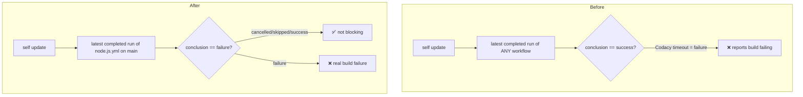

# 3.5.1 — Fix false "build failing" in `lsh self update`

Patch release.

## Fix

`lsh self update` reported the **build as failing for the latest version** when it
wasn't. `checkCIStatus` queried the most recent completed run of **any** workflow
(`/actions/runs?per_page=5`) and treated a non-`success` conclusion as a failing build.
So a flaky **security scan** — e.g. Codacy timing out downloading `codeql-action`
(`HttpClient.Timeout of 100 seconds`) — read as "build failing", even though the actual
build (`Node.js CI`) was fine (just queued on the self-hosted runner, or cancelled by
concurrency).

Two changes:
- **Scope to the build workflow**: query `actions/workflows/node.js.yml/runs?branch=main`
  instead of all workflows, so security-scan results can't be mistaken for the build.
- **Only block on a real failure**: `cancelled` / `skipped` / `null` conclusions are infra
  noise (the build is frequently cancelled by concurrency on the self-hosted runner) and no
  longer report as failing. Logic extracted to a pure, unit-tested `evaluateBuildRuns()`.

## Before / After

## Verification

- `npm run typecheck` / `npm run build` — 0 errors
- `npm run lint` — 0 errors
- New `__tests__/self-ci-status.test.ts` — 6/6 pass (failure blocks; cancelled/skipped/success/empty don't)
- Full suite — 998 passed, 0 failed
