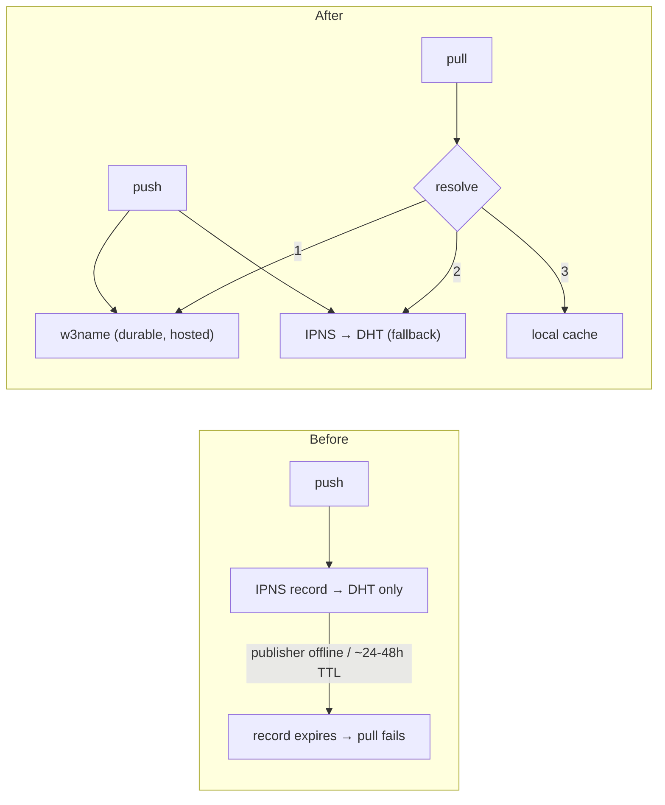

# 3.6.0 — Durable secret discovery via w3name (issue #194)

Adds a durable discovery layer so `lsh pull` keeps resolving even when the publishing node
goes offline — fixing the IPNS-over-DHT expiry that caused "Could not resolve secrets from
network" once no node republished the record (~24–48h DHT TTL).

## What changed

The `key→CID` pointer now goes through a pluggable **`DiscoveryBackend`** (`src/lib/discovery-backend.ts`):

- **`w3name`** (new, default): publishes a **signed IPNS record** to Storacha's w3name
  (`name.web3.storage`) — durable, no DHT TTL, **no account / no auth**. The w3name name is
  **identical** to the Kubo-derived IPNS name (same key-derived seed), so it's one logical pointer.
- **`ipns`** (existing): IPNS-over-DHT, kept as fallback + backward compat.

**Default `LSH_DISCOVERY=w3name,ipns`:** push **dual-writes** to both; pull resolves
**w3name → ipns → local cache**. Set `LSH_DISCOVERY=ipns` for DHT-only (previous behavior).

## Before / After

## Important: discovery ≠ availability

w3name makes the **pointer** durable. The **encrypted bytes** still need a host — keep a node
online or configure a pin service (`LSH_PIN_SERVICE`). A bundled default free pinner (4EVERLAND)
is planned next (issue #194, Phase 3).

## Notes
- `w3name` + `@libp2p/crypto` added as deps; **lazily imported** (only loaded when w3name is used).
- w3name calls are timeout-bounded (resolve 10s / publish 15s) and best-effort — a w3name hiccup
  never blocks push/pull (IPNS fallback covers it).
- Behavior change: pushes now also publish to w3name by default (free, best-effort).

## Verification
- typecheck/build 0 errors; lint 0 errors
- discovery seam: 19 unit tests (IPNS + w3name backends, composite dual-write/fallback, config parsing)
- full suite: 1017 passed; coverage ≥ threshold (discovery-backend.ts 100%)
- Phase-2 spike confirmed seed→w3name name == Kubo IPNS name + publish/resolve round-trip
