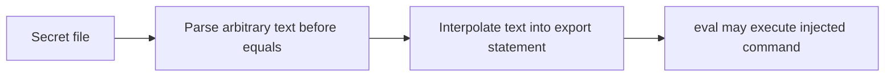
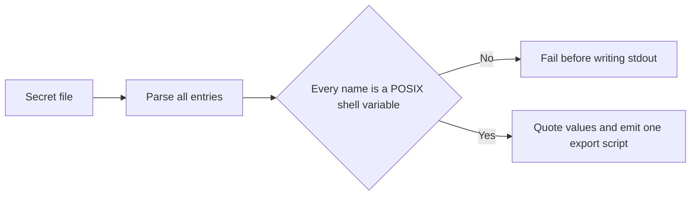

# 3.7.1 — Block shell-command injection in export output

Fixes issue #220.

## Security fix

LSH validated names written by `lsh set`, but trusted names read from secret files. The
shell-export paths then interpolated those names into executable output, so a crafted name could
become a command when someone followed the documented `eval "$(lsh load)"` workflow.

**Before**

**After**

## Changes

- We now use one environment-variable-name rule: `^[A-Za-z_][A-Za-z0-9_]*$`.
- `load`, `env --format export`, `list --format export`, `get --all --export`, and sync/load
  output now use the same formatter.
- We validate every name before emitting output, so a failure can't leave a partial script on
  stdout.
- Values remain literal through POSIX-safe single-quote escaping.

## Verification

- Focused export and CLI regression tests: 67 passed
- Full Jest suite: 1,097 passed, 28 skipped
- ESLint: no errors
- TypeScript typecheck and build: passed
