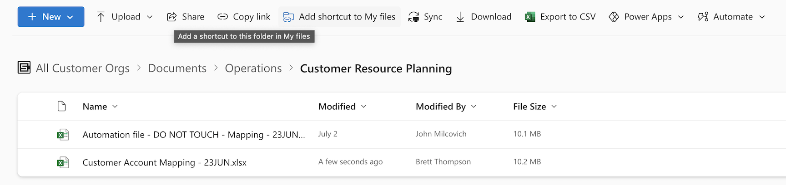
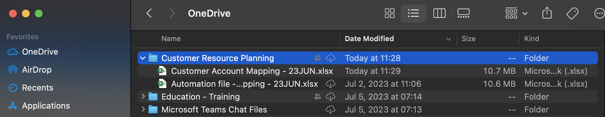

## Collecting SE Feedback

The `se_reviewers.py` script can be used to pre-populate the se monthly feedback review sheet before sending to managers for refinement.

To generate the reviewer list, the script reads the global staffing assignments, iterates through each active SE row and identifies that SE's collaborators.

The following logic is in place:
- Associate SEs and Contractors are not made reviewers
- For larger teams (>3 people)
    - Directors & Architects are not made reviewers for juniors
    - Data Engineers are not made reviewers for seniors / managers
- The 'Internal: Operations & Management' is omitted

## Usage

### Add "Customer Account Mapping" staffing spreadsheet locally
Use the "Add shortcut to My files" button in OneDrive to create a local directory of the OneDrive location


This will ensure the file is available locally:


Which is typically stored in this machine location:
```
'~/Library/CloudStorage/OneDrive-C3.ai,INC/Customer Resource Planning/Customer Account Mapping - 23JUN.xlsx'
```
### Clone the repository
https://github.com/c3-e/c3-semgt
```bash
git clone git@github.com:c3-e/c3-semgt.git
```

### Install python3
https://www.python.org/downloads/

### Install OpenPyxl
`pip3 install openpyxl`

### Run the script
To use the script, open a shell terminal & navigate to this directory:
```bash
cd ~/path/to/c3-semgmt/src/SEFeedback/ ## replace with correct path
pip3 install -r requirements.txt        ## install python3 requirements
```

Run the following from this file location
```bash
python3 se_reviewers.py                 ## run script with default arguments

python3 se_reviewers.py -h              ## pull up the script command help text
```

Help text:
```bash
usage: se_reviewers.py [-h] [-fp FILEPATH] [-o OUTPUT] [-n NAME]

Automatically generate monthly reviewers for SE team

options:
  -h, --help            show this help message and exit
  -fp FILEPATH, --filepath FILEPATH
                        reachable filepath for the staffing file. Default: ~/Library/CloudStorage/OneDrive-C3.ai,INC/Customer Resource Planning/Customer Account Mapping - 23JUN.xlsx
  -o OUTPUT, --output-dir OUTPUT
                        directory to write output file. Default: ~/Desktop
  -n NAME, --output-name NAME
                        name of output file. Default: Engineers_To_Review_YYYY_MM
```

Sample command using all arguments:
```bash
python3 se_reviewers.py -fp </path/to/staffing/file> -o </path/to/output/directory> -n <filename> 
```