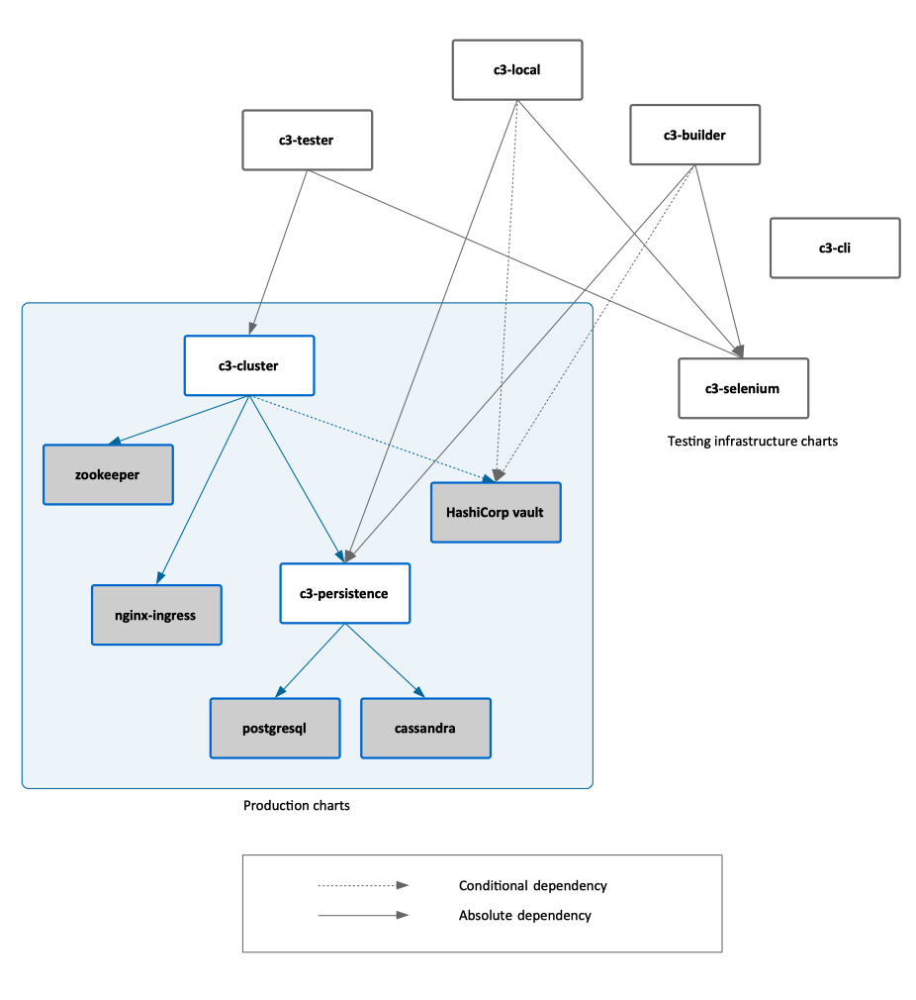

# Helm Charts

[Up](../README.md)

## Overview

This directory contains helm charts to install various flavors of C3 cluster on K8s, along with some tests and environment-specific configuration files.
The charts are related to each other as follows:

All charts in this directory are released as part of a formal release process and they are published in the [C3 chart repository](https://ci-artifacts.c3.ai/v1/helm) as versioned Helm chart archives. The release can be performed manually, or it can be artifact pipeline-driven. More details about the chart release process are available in the [Infrastructure Operations Manual](../guides/infrastructure-operations-manual.md#helm-charts).

### Charts

* [c3-cluster](./charts/c3-cluster/README.md)
* [c3-tester](./charts/c3-tester/README.md)
* [c3-builder](./charts/c3-builder/README.md)
* [c3-local](./charts/c3-local/README.md)
* [c3-persistence](./charts/c3-persistence/README.md)
* [c3-selenium](./charts/c3-selenium/README.md)

## Values

Values are inferred and merged in the following order (from lowest to highest priority):

1. the (static) `values.yaml` file
2. `yaml` template files (ending with `*.yaml.tmpl`) in the `overrides` directory are generated dynamically using [`gomplate`](https://docs.gomplate.ca/) and applied in lexicographical order. Both, the helm set options and the static `values.yaml` file are registered as [datasources](https://docs.gomplate.ca/datasources/) `cli` and `values` respectively. This allows for a DRY definition of values.

    **NOTE**: generated `yaml` files are stored in the `values/` directory for inspection. See the [templating basics](https://docs.gomplate.ca/syntax/) for an overview of templating language capabilities.
3. the `c3-k8s` script sets specific helm options depending on what chart is installed
